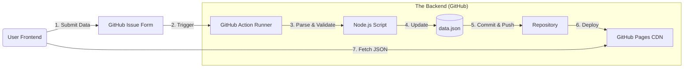

Here is the comprehensive technical documentation for the **Zero-Cost IssueOps Storage Architecture**. You can copy and paste this directly into your IDE (like Cursor or VS Code Copilot) or give it to an AI agent to start the implementation.

---

# Project Manifest: Serverless Data Storage via GitHub IssueOps

## 1. Executive Summary

**Objective:** Implement a decentralized, zero-cost backend for user data storage and retrieval using GitHub's native infrastructure.
**Strategy:** "IssueOps" (Issue Operations).
**Core Logic:**

* **Write Operation:** Users submit data via **GitHub Issue Forms**.
* **Backend Logic:** **GitHub Actions** parse the issue payload and update a flat-file JSON database in the repository.
* **Read Operation:** The frontend fetches the raw JSON file via **GitHub Pages** (CDN).
* **Cost:** **$0** (Leveraging unlimited Action minutes for Public Repositories and GitHub Pages bandwidth).

---

## 2. Architecture Reference



---

## 3. Implementation Specifications

### 3.1. Infrastructure Setup

* **Repository Visibility:** `Public` (Crucial for free unlimited GitHub Actions minutes).
* **GitHub Pages:** Enabled on the `main` branch (or `gh-pages` branch).
* **Permissions:** Default `GITHUB_TOKEN` must have `contents: write` and `issues: write`.

### 3.2. Data Schema (`db/data.json`)

The source of truth will be a flat JSON array.

```json
[
  {
    "id": 101,             // Derived from Issue Number
    "username": "userX",   // From Issue Form
    "payload": "...",      // User content
    "timestamp": "2024-01-24T12:00:00Z",
    "status": "active"
  }
]

```

### 3.3. Write Interface: Issue Forms

**File:** `.github/ISSUE_TEMPLATE/submission.yml`
**Purpose:** Enforce structured data input to simplify parsing.

```yaml
name: Data Submission
description: Upload data to the public registry.
title: "[Data]: "
labels: ["data-submission"]
body:
  - type: input
    id: username
    attributes:
      label: Username/Alias
    validations:
      required: true
  - type: textarea
    id: content
    attributes:
      label: JSON Data or Text Content
    validations:
      required: true

```

### 3.4. Backend Logic: The Processor

**File:** `.github/workflows/process-data.yml`
**Trigger:** `issues: [opened, edited]`
**Logic:**

1. Check if label is `data-submission`.
2. Checkout code.
3. Run a script (Node.js recommended) to:
* Read `db/data.json`.
* Parse the Issue Body using a YAML/Markdown parser.
* Upsert the record based on Issue ID.
* Write back to `db/data.json`.


4. Commit and Push changes using the `github-actions[bot]` user.
5. (Optional) Close the issue automatically with a comment: "Data indexed successfully."

### 3.5. Read Interface: The API

**Endpoint:** `https://<username>.github.io/<repo>/db/data.json`
**Usage:**

* Frontend performs a standard `GET` request.
* Data is cached globally via GitHub's CDN.

---

## 4. Operational Constraints & Optimizations

To maintain the "Zero-Cost" status and adhere to fair use policies, the Agent must implement the following safeguards:

| Constraint | Strategy |
| --- | --- |
| **Concurrency** | Since git commits can conflict if two Actions run simultaneously, the workflow must utilize `concurrency` groups or a retry logic in the commit step. |
| **File Size** | If `data.json` > 5MB, the parser script should implement **Sharding** (e.g., `data/2024-01.json`) based on the timestamp to prevent git bloat and slow frontend loading. |
| **Rate Limiting** | GitHub Pages has a soft limit of 100GB/month bandwidth. Ensure the Frontend caches the JSON response (e.g., using `localStorage` or Service Workers) to reduce hits. |
| **Security** | The Action script **MUST** sanitize user input (HTML escaping) before saving to JSON to prevent XSS attacks on the frontend. |

---

## 5. Directives for the Developer Agent

**Action Items:**

1. **Initialize Repository:** Create the folder structure `.github/workflows` and `.github/ISSUE_TEMPLATE`.
2. **Create Template:** Generate the `submission.yml` file as defined in Spec 3.3.
3. **Develop Processor:** Write a robust Node.js script (`scripts/process_issue.js`) that:
* Uses `@actions/core` and `@actions/github`.
* Parses the Issue Body strictly.
* Validates the payload (e.g., ensures it is not empty).
* Handles JSON read/write errors gracefully.


4. **Configure Workflow:** Create the GitHub Action YAML to execute the script and handle the Git Commit/Push lifecycle.
5. **Frontend POC:** Create a simple `index.html` that fetches the raw JSON data and renders it to a list, demonstrating the read capability.

**Do not** set up any external databases (Firebase, Supabase, SQL).
**Do not** set up any external servers (Heroku, Vercel Backend).
**Strictly adhere** to the public repository configuration to ensure free tier usage.